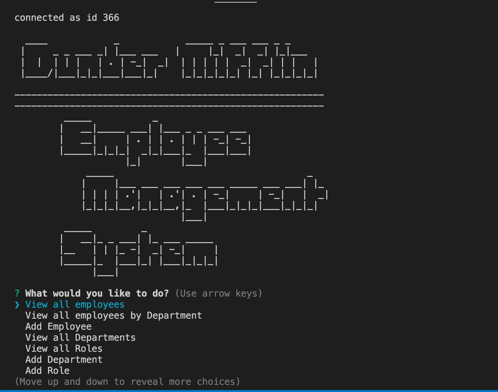

# Employee Tracker 

   
  This application allows user to interact with databse containing information about an organization. 

   

   [Github repo](https://github.com/Amal31497/Employee-Tracker)

   

  ## Table of Contents 
 
  ##### * [Technologies used](#Technologies)
  ##### * [Usage walkthrough](#Walkthrough)
  ##### * [Installation](#Installation)
  ##### * [Credits](#Credits)
  ##### * [License](#License)
  ##### * [Contact Info](#Contact)

  ## Technologies:
   _*Javascript,Node.js,Others*_

  ## Walkthrough:
  #### Video:
  Please follow this *[link](https://youtu.be/t6gynIFNAVc)* to watch the walkthrough video.

  #### Screenshots:
  

  ## Installation:
  Run the following commands in your integrated terminal to initalize the application:

    1. git clone [Repository link you can find under "code" button] (To get the code from a repo)

    2. npm install

    3. npm install mysql

    3. run etschema.sql and seeds.sql in mysql workbench to seed all information into the database

    4. Interact with the app through console by running node index.js

  
  ## Credits:
  [w3schools](w3schools)
  [MDN](MDN)

  ## License: 

  ##### Copyright: Amal Janabayev

  ##### 

  ##### [License Link](https://opensource.org/licenses/MIT)

  ## Contact: 

  ##### amalj2426@gmail.com